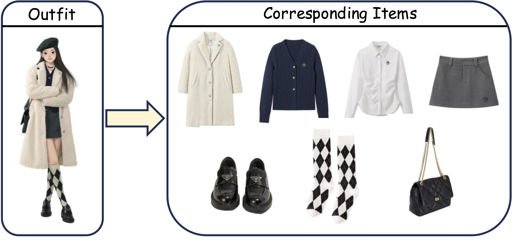
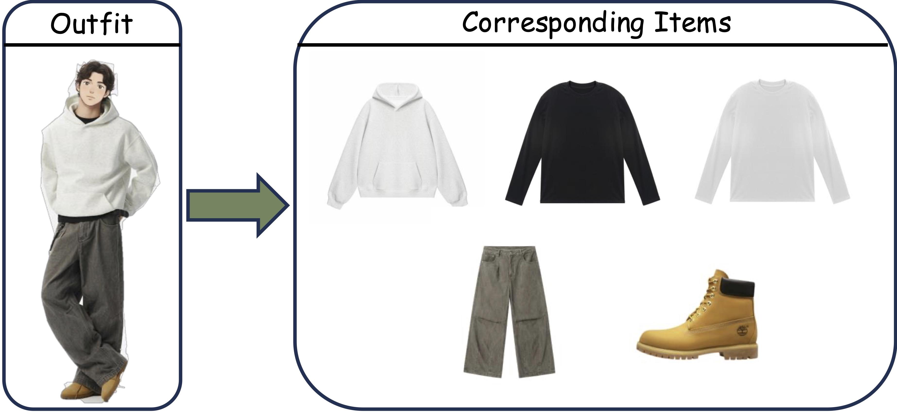
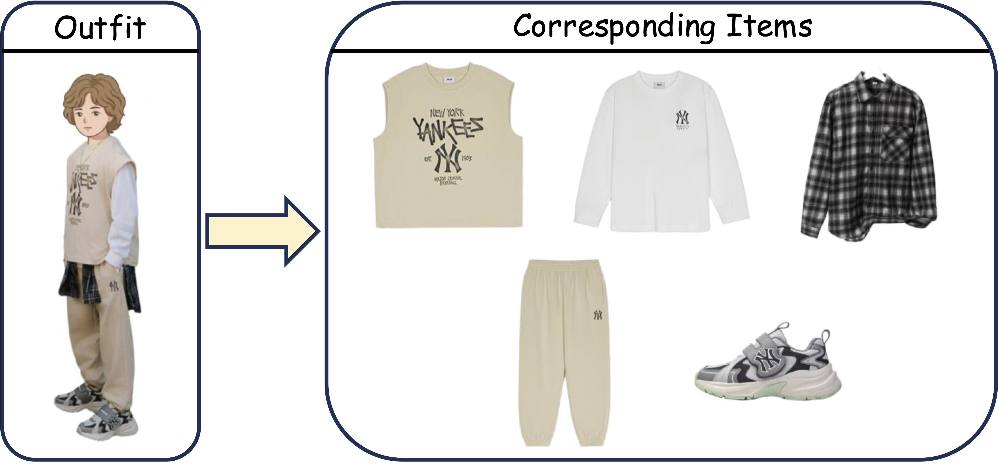

#  FashionStylist: An Expert Knowledge-enhanced Multimodal Dataset for Fashion Understanding

## Supplementary Material

Experimental baseline settings and all prompts used in our experiments are provided in [`Supplementary_material.pdf`](./Supplementary_material.pdf).

## News

- [x] **April 8, 2026**: Released **English version** of FashionStylist V1.
- [x] **April 1, 2026**: Released **FashionStylist V1**, including **1,000 outfit-level entries** and **4,637 item-level annotations** across **Female**, **Male**, and **Child** subsets.
<!-- - ☐ **TBA**: Release **FashionStylist V2**, a larger-scale version of the dataset. -->

## Dataset Overview

FashionStylist is an expert knowledge-enhanced multimodal fashion dataset for outfit-level and item-level fashion understanding. The current release organizes the data into three subsets:

- **Female**: 500 outfits, 2,406 items
- **Male**: 300 outfits, 1,390 items
- **Child**: 200 outfits, 841 items

In V1, each outfit is linked to all of its items through an outfit identifier (`outfitID`) and a list of item identifiers (`items`). The dataset supports research on outfit understanding, item attribute recognition, fashion description grounding, cross-modal retrieval, and multimodal reasoning.

The dataset is available in both **Chinese** and **English**.

### Outfit Examples

| Female | Male | Child |
| --- | --- | --- |
|  |  |  |

### Dataset File Organization

```text
Dataset
├── Child/
│   ├── look(b1-200).csv          # Chinese
│   ├── look_en.csv               # English
│   ├── label(p1-841).csv         # Chinese
│   └── label_en.csv              # English
├── Female/
│   ├── look(b1-500).csv          # Chinese
│   ├── look_en.csv               # English
│   ├── label(p1-2406).csv        # Chinese
│   └── label_en.csv              # English
└── Male/
    ├── look(b1-300).csv          # Chinese
    ├── look_en.csv               # English
    ├── label(p1-1390).csv        # Chinese
    └── label_en.csv              # English
```

### Annotation Schema

**Outfit-level annotations** (`look*.csv` / `look_en.csv`)

- `outfitID`: outfit identifier
- `items`: comma-separated item identifiers belonging to the outfit
- `look`: free-form outfit description
- `season`: normalized season label, with 6 classes: `春`/`Spring`, `夏`/`Summer`, `秋`/`Autumn`, `冬`/`Winter`, `春夏`/`Spring/Summer`, `秋冬`/`Autumn/Winter`
- `occasion`: normalized occasion label, with 7 base classes (`运动`/`Sports`, `出行`/`Travel`, `日常`/`Daily`, `校园`/`School`, `社交`/`Social`, `商务`/`Business`, `居家`/`Home`) and their slash-separated combinations (e.g., `日常/出行`, `运动/出行`)
- `URL link`: source product or style reference URL (Chinese only)

**Item-level annotations** (`label*.csv` / `label_en.csv`)

- `itemID`: item identifier
- `category`: item category (English only): `outerwear`, `mid_layer_top`, `inner_top`, `bottom`, `shoes`, `bag`, `accessory`, `onepiece`
- `title`: item title
- `gender`: target gender group
- `style`: style annotation
- `outline`: silhouette / outline
- `materials`: material annotation
- `color`: color annotation
- `pattern`: pattern annotation
- `detail`: design detail annotation
- `donning/doffing`: wearing or removal mode
- `URL link`: source product URL (Chinese only)


## Benchmark

Benchmark baselines and evaluation code for three tasks are available in the [`Benchmark/`](./Benchmark/) directory: [Task 1 — Outfit2item Grounding](./Benchmark/Task1/), [Task 2 — Outfit Completion](./Benchmark/Task2/), [Task 3 — Outfit Evaluation](./Benchmark/Task3/).

## Todo List

- [x] Release **FashionStylist V1**
- [x] Release an **English version** of FashionStylist
- [x] Release benchmark and baseline code for the dataset
- [ ] Release **FashionStylist V2**, a larger-scale version of the dataset

## Acknowledgement

Our benchmark baselines are built on several excellent open-source projects. We thank the authors and maintainers of these repositories:

- **CIRP**: https://github.com/HappyPointer/CIRP
- **DiFashion**: https://github.com/YiyanXu/DiFashion
- **CLHE**: https://github.com/Xiaohao-Liu/CLHE
